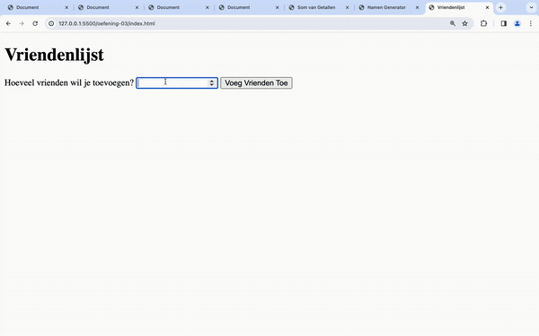
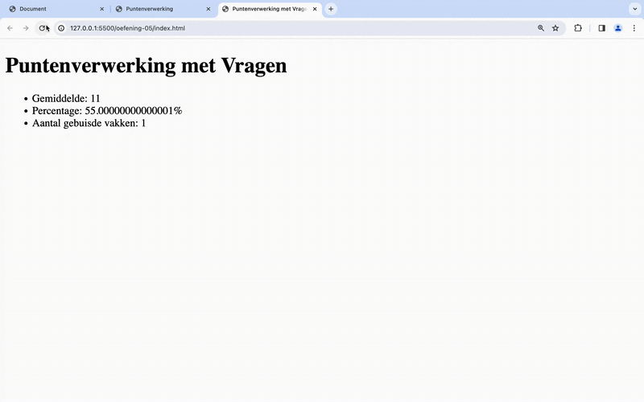
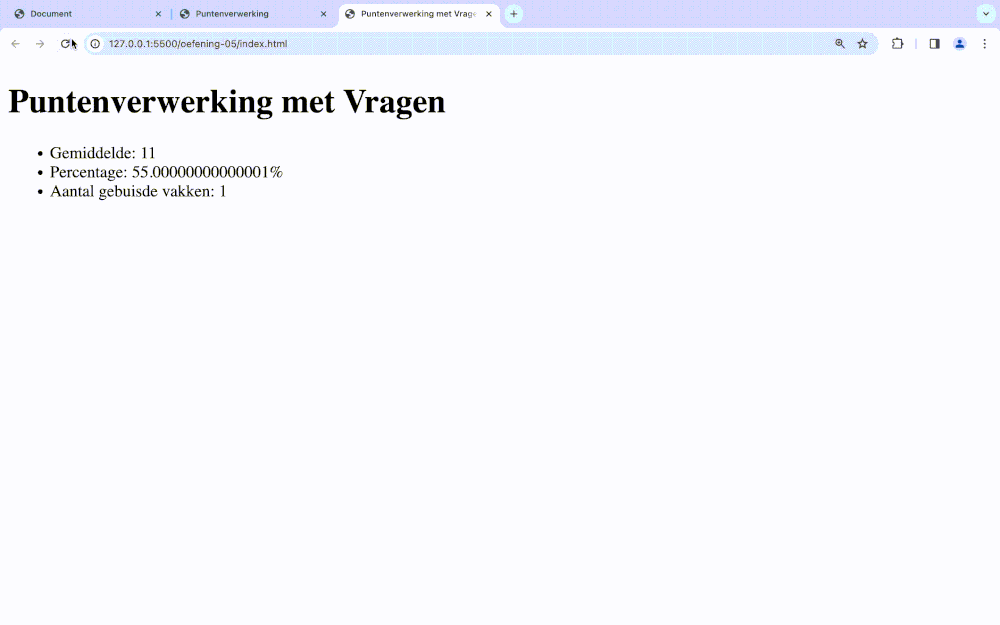
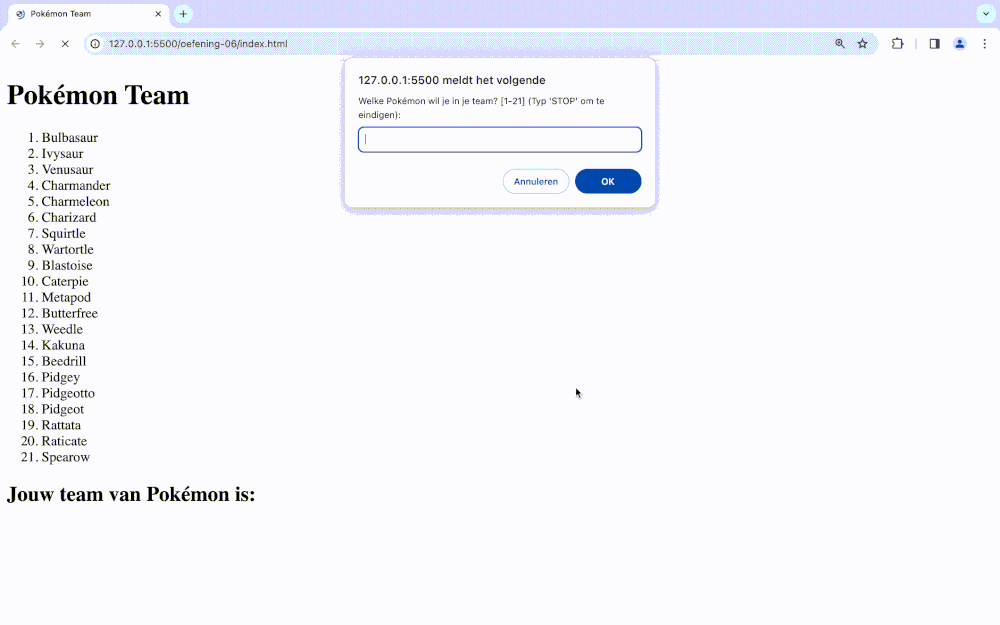
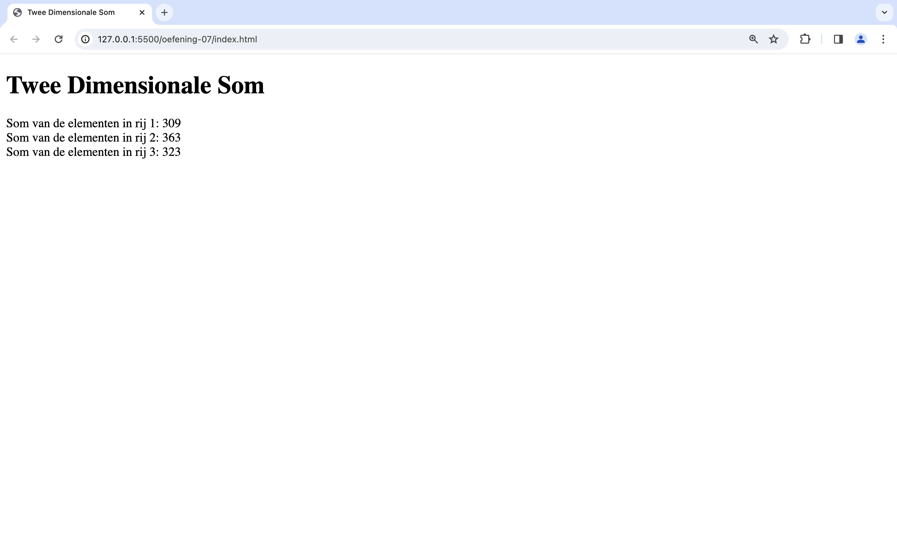
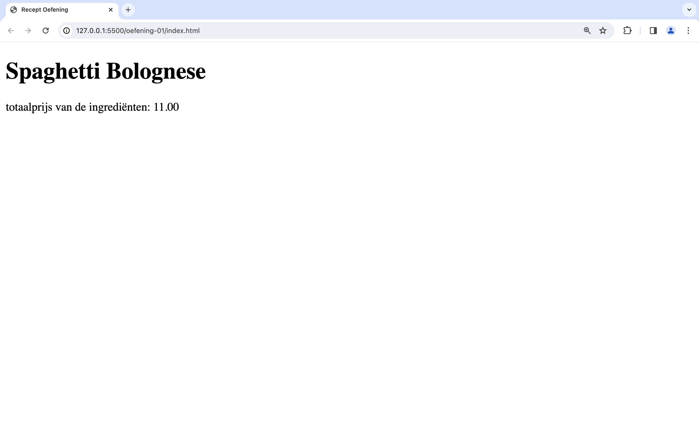
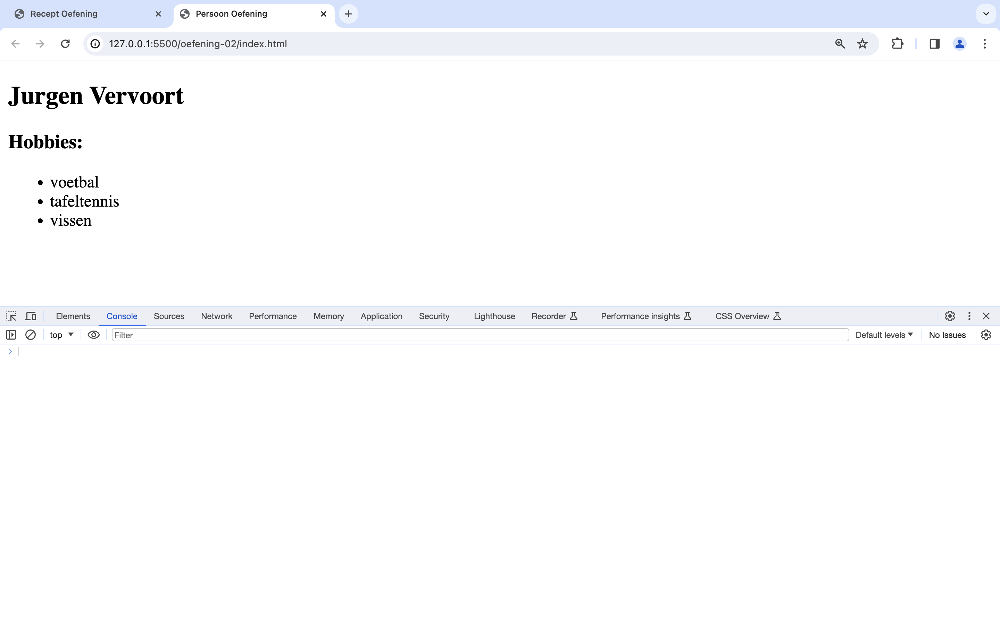
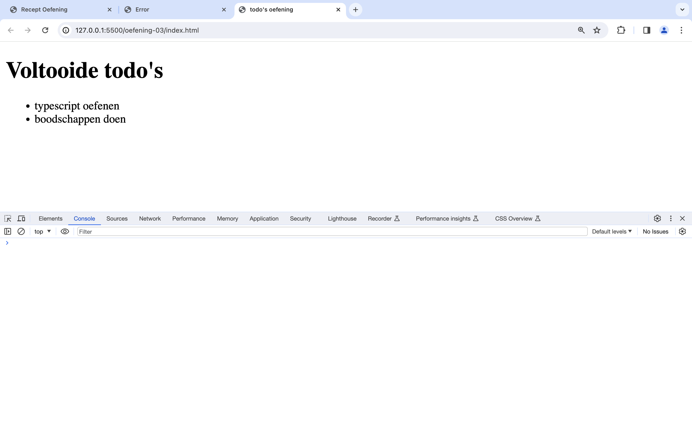
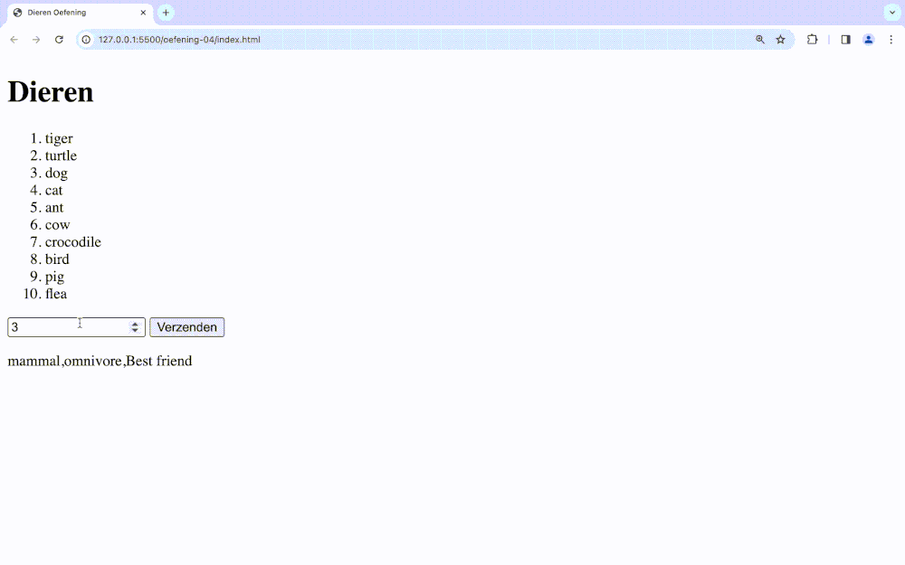

# Labo 14

Zorg dat je de volgende folder structuur volgt:

```
webtechnologie/
├─ labo-01/
│  ├─ oefening-01/
│  │  ├─ index.html
│  │  ├─ images/
│  │  │  ├─ image-1.jpg
│  │  │  └─ image-n.jpg
│  │  ├─ css/
│  │  │   ├─ reset.css
│  │  │   └─ style.css
│  │  ├─ data/
│  │  │   ├─ datafile-1.json
│  │  │   └─ datafile-2.json
│  │  └─ js/
│  │     └─ script.js
│  ├─ oefening-02/
│  └─ oefening-n/
├─ labo-02/
└─ labo-n/
```

- Gebruik steeds JS modules om globale variabelen te vermijden (`<script type="module" src="./path/to/script.js"></script>`)
- Zet je Javascript file steeds in strict mode (`"use strict"`);
- Volg de [Coding Guidelines](https://apwt.gitbook.io/webtechnologie/coding-guidelines)


## Oefeningen arrays

### oefening 1: som

#### leerdoelen

* werken met arrays
* lengte van arrays opvragen
* arrays doorlopen met een for-loop

#### functionele analyse

Je programma geeft de som van een rij getallen terug.

#### technische analyse

Je begint met een `array` te maken van de getallen 1, 2, 3, 4, 5 en 6. Je maakt een variabele `som` en kent er de waarde 0 aan toe.

Vervolgens maak je een lus die van 0 tot het aantal getallen in de array itereert. Elke iteratie tel je het huidige getal op bij een variabele som.

De som print je af op in de console.

#### voorbeeldinteractie


### oefening 2: namen

#### leerdoelen

* werken met arrays
* lengte van arrays opvragen
* arrays doorlopen met een for-loop

#### functionele analyse

Je programma genereert op basis van 2 arrays een lijst van voor- en achternamen.

#### technische analyse

Maak 2 string-arrays aan. De eerste geef je 5 voornamen, de andere 5 achternamen.

Controleer dat de lengte van beide arrays gelijk is. Zo niet print je een foutboodschap.

Gebruik een for-loop om door de lijst van namen te loopen.

Toon vervolgens een lijst uit met voor- en achternamen op de scherm van de browser.

#### voorbeeldinteractie


### oefening 3: vrienden

#### leerdoelen

* werken met gebruikersinteractie
* werken met for-loop
* toevoegen van elementen in een array

#### functionele analyse

Je programma vraagt hoeveel vrienden er moeten worden ingevoerd. Op basis daarvan kan je daarna je vrienden toevoegen aan een lijst. Nadien wordt de lijst uitgeprint (laatste ingave eerst).

#### technische analyse

Vraag de gebruiker hoeveel namen er moeten worden ingegeven. Maak hiervoor gebruik van input-veld.

Vraag dan X aantal keer de naam van de vriend dat je wenst toe te voegen. **Hint**: je kan voor deze oefening `prompt()` gebruiken om de gebruiker te vragen achter de namen.

Voeg de vrienden toe aan een array van vrienden.

Toon vervolgens de lijst met vrienden in een lijst.

#### voorbeeldinteractie



### oefening 4: punten

#### leerdoelen

* werken met for-of-loop
* werken met arrays
* wiskundige bewerkingen

#### functionele analyse

Je programma verwerkt een puntenlijst aan resultaten en print het gemiddelde, het percentage en het aantal gebuisde vakken uit.

#### technische analyse

Gebruik voor deze oefening volgende array:

```
const grades = [16,12,16,7,17,14,9,8,18,12];
```

Gebruik een for-of-loop om door de grades te loopen.

Bereken het gemiddelde, het percentage en het aantal gebuisde vakken.

Toon deze waardes op het scherm in een lijst.

#### voorbeeldinteractie



### oefening 5: punten met vragen

#### leerdoelen

* gebruiken van do while loop
* werken met arrays
* input vragen

#### functionele analyse

Je breidt de punten oefening uit zodat de gebruiker zelf de punten kan ingeven.

#### technische analyse

Schrijf eerst een do while loop om de punten te vragen. Op de moment dat de gebruiker geen getal meer ingeeft dan worden dezelfde waarden getoond aan de gebruiker als in de vorige oefening.

#### voorbeeldinteractie



### oefening 6: pokémon team

#### leerdoelen

* gebruiken van loops
* werken met arrays
* zoeken in arrays

#### functionele analyse

Je programma maakt het mogelijk om de gebruiker een team van pokémon samen te stellen.

#### technische analyse

Gegeven is de volgende array van 20 pokemon:

```
let pokemon = [
    "Bulbasaur",
    "Ivysaur",
    "Venusaur",
    "Charmander",
    "Charmeleon",
    "Charizard",
    "Squirtle",
    "Wartortle",
    "Blastoise",
    "Caterpie",
    "Metapod",
    "Butterfree",
    "Weedle",
    "Kakuna",
    "Beedrill",
    "Pidgey",
    "Pidgeotto",
    "Pidgeot",
    "Rattata",
    "Raticate",
    "Spearow",
];
```

* Maak een array `team`. Deze array bevat de pokémon van de gebruiker van het programma.
* Gebruik een lus om de pokémon in een genummerde lijst te tonen aan de gebruiker.

```
1. Bulbasaur
2. Ivysaur
3. Venusaur
4. Charmander
5. Charmeleon
...
```

* Vraag daarna aan de gebruiker welke pokémon er moet toegevoegd worden aan het team. Dit doe je aan de hand van de index van de pokemon. Dit doe je tot de gebruiker STOP ingeeft. Je kan dit doen aan de hand van een `do while` loop.

```
Welke pokemon wil je in je team? [1-21]: 4
Welke pokemon wil je in je team? [1-21]: 3
Welke pokemon wil je in je team? [1-21]: STOP
```

* Als de gebruiker een pokémon ingeeft die al in het team zet dan krijgt hij hiervan een melding en wordt de pokémon niet toegevoegd:

```
Welke pokemon wil je in je team? [1-20]: 4
Welke pokemon wil je in je team? [1-20]: 3
Welke pokemon wil je in je team? [1-20]: 4
Deze pokemon zit al in je team
Welke pokemon wil je in je team? [1-20]: 2
Welke pokemon wil je in je team? [1-20]: STOP
```

* Als de pokémon niet bekend is (dus het ingegeven nummer groter is dan de lengte van de array) wordt er ook een melding gegeven:

```
Welke pokemon wil je in je team? [1-21]: 22
Deze pokemon ken ik niet
Welke pokemon wil je in je team? [1-21]: 4
```

* Als je STOP hebt ingegeven dan wordt het team van de gebruiker op het scherm getoond:

```
Welke pokemon wil je in je team? [0-20]: 1
Welke pokemon wil je in je team? [0-20]: 2
Welke pokemon wil je in je team? [0-20]: 3
Welke pokemon wil je in je team? [0-20]: 4
Welke pokemon wil je in je team? [0-20]: 5
Welke pokemon wil je in je team? [0-20]: 6
Welke pokemon wil je in je team? [0-20]: STOP
Jouw team van pokemon is: 
1. Ivysaur
2. Venusaur
3. Charmander
4. Charmeleon
5. Charizard
6. Squirtle
```

#### voorbeeldinteractie



### oefening 7: tweedimensionale som

#### leerdoelen

* twee dimensionale arrays

#### functionele analyse

We gaan de som berekenen van alle waarden van een tabel (of tweedimensionale array).

#### technische analyse

We beginnen met de volgende twee dimensionele array:

```
let spreadsheet = [
    [100, 104, 105],
    [144, 110, 109],
    [105, 107, 111]
];
```

* Maak een variabele `sumRow1` en ken de som van de drie elementen van de eerste rij hieraan toe.
* Print de som uit op het scherm.
* Doe hetzelfde voor de andere rijen.

#### voorbeeldinteractie



## Oefeningen objecten en JSON

### oefening 8: recept

#### leerdoelen

* objecten aanmaken
* dot notatie gebruiken
* lussen

#### functionele analyse

Het programma berekent de totaalprijs van een gegeven recept.

#### technische analyse

Je maakt een object. Dit bevat een

* naam
* beschrijving
* personen
* ingredienten

de ingredienten bevatten een:

* naam
* hoeveelheid (bv "1 stuk", "1 kg")
* prijs

Maak het object aan met zelfgekozen values en ken deze toe aan aan variabele `spaghetti`.

Print de naam van dit gerecht af (via de dot-notatie) gevolgd door de totaalprijs van alle ingredienten.

#### voorbeeldinteractie



### oefening 9: persoon

#### leerdoelen

* objecten aanmaken
* dot-notatie gebruiken
* gebruik/uitlezen van JSON
* schrijven van functies

#### functionele analyse

Lees een json-bestand in en print daar enkele waardes van op het scherm

#### technische analyse

Maak een **person.json** bestand aan met volgende data:

```
{
  "firstname": "Jurgen",
  "lastname": "Vervoort",
  "age": 27,
  "city": "Heist-op-den-Berg",
  "street": "Bergstraat",
  "number": "17c",
  "postal": 2220,
  "hobbies": ["voetbal", "tafeltennis", "vissen"]
}
```

1. Lees het _person.json_ bestand in
2. Maak een eerste functie _printFullName()_ dat het ingelezen object als parameter ontvangt en de volledige naam van de persoon uitprint.
3. Maak een tweede functie _printHobbies()_ dat het ingelezen object als parameter ontvangt en de hobby's van de persoon oplijst.

#### voorbeeldinteractie



### oefening 10: todo's

#### leerdoelen

* objecten aanmaken
* dot-notatie gebruiken
* gebruik/uitlezen van JSON
* schrijven van functies
* werken met arrays van objecten

#### functionele analyse

Lees todos.json (aanwezig naast deze README file) uit en haal er enkel de reeds voltooide todo's uit.

#### technische analyse

1. Maak een array van Todos door het bestand todos.json uit te lezen.
2. Schrijf een functie _getCompleted()_ dat als parameter je array ontvangt. Zorg ervoor dat de functie een array teruggeeft met _enkel de voltooide_ todo's.
3. Toon de voltooide todo's op de website in een lijst.

#### voorbeeldinteractie



### oefening 11: dieren

#### leerdoelen

* objecten aanmaken
* dot-notatie gebruiken
* gebruik/uitlezen van JSON
* werken met gebruikersinteractie
* werken met arrays van objecten

#### functionele analyse

Toon de gebruiker een lijst van dieren. Nadat de gebruiker een dier kiest wordt wat info betreffende dat gekozen dier weergegeven.

#### technische analyse

Maak een array van dieren `animalData` door het bestand dieren.json in te lezen d.m.v. `import`.

Maak een functie _getAnimalsList() dat de animal\[] als parameter ontvangt en een string\[] van alle dierennamen teruggeeft._

Nu kan je de gebruiker laten kiezen uit 1 van de dieren. Gebruik de arraypositie om de info op te vragen van het gekozen dier.

#### voorbeeldinteractie


